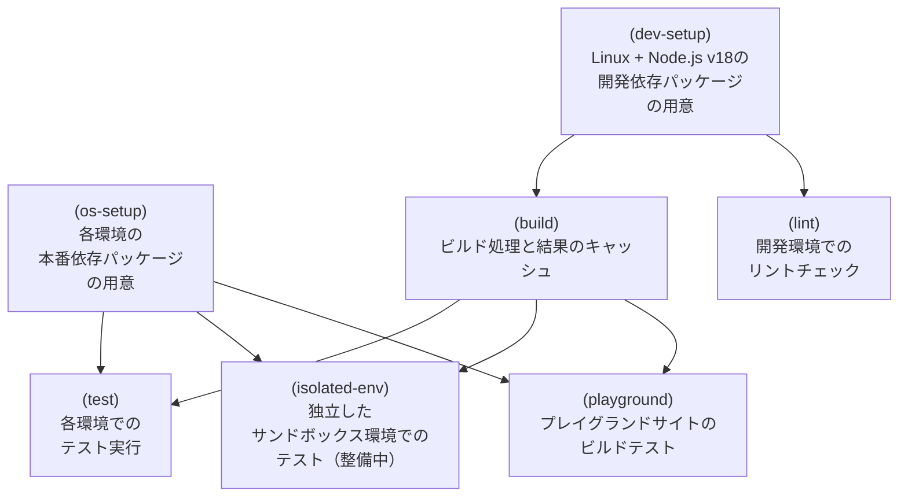

[Markuplint](https://markuplint.dev/)の開発で今までGitHub Actionsはずっと雰囲気で利用をしていたけど、今回本腰入れていろいろと調べて改善を行なった。その備忘録。

## 結論

- `actions/cache/restore`と`actions/cache/save`を上手くつかってキャッシュをつくる
- ビルド結果はキャッシュする
- 依存パッケージのインストール結果はキャッシュする
- 処理を`jobs`に分割する
- `needs`を使って処理の順番をつくる
- テストは`shard`オプションを使って並列で実行する

<!-- prettier-ignore-start -->

*`os-setup`、`dev-setup`、`build`、`lint`、`test`、`isolated-env`、`playground`の7つのジョブがあり、部分的に依存したフローになっている*
<!-- prettier-ignore-end -->

## 改善前の課題

性格上、結構雑にPRを作るので、そのたびに走るテストワークフローの時間がストレスになっていた。また現状のテストでは発見できない問題があったりとテスト自体を改善したりテスト環境のバリエーションを増やす必要があった。さらにNode.js v14が4月30日で終了になったこともあり、それらの対応がいろいろ考えるキッカケにもなっている。課題を整理してみると次のようになる。

- 時間がかかる
- 開発はNode.js v18でOKだが、Markuplintのメジャーバージョンアップまではv14のテストは維持する必要がある^[破壊的変更を同じメジャーバージョン中に行いたくないため]
- マトリックス（後述）のすべてで依存パッケージのインストール、ビルド、テストまで行なっていたので無駄が多い
- テスト実行時に開発用依存パッケージ（`devDependencies`）がインストールされているせいでテストが失敗しない問題がある
- キャッシュを効率的に扱えていない（というかキャッシュをちゃんとわかってない）
- GitHub Actionsの知識がそもそも皆無

テスト対象のマトリックスは次のようにしていた。

| OS      | Node.jsバージョン |
| ------- | ----------------- |
| Linux   | 18                |
| Linux   | 14                |
| macOS   | 14                |
| Windows | 14                |

しかし、v14の終了とv20も来ているので次のように網羅的に対応したい。

| OS      | Node.jsバージョン |
| ------- | ----------------- |
| Linux   | 20                |
| Linux   | 18                |
| Linux   | 16                |
| Linux   | 14                |
| macOS   | 18                |
| Windows | 18                |

## 改善戦略

実行のタイミングやGitHubの状況や依存サーバーのネットワークの状況によって変動はあるものの、早くて**7分**、だいたい**10分〜15分**くらいかかっている。早いか遅いかは、他の開発と比べても内容や状況が違うのでなんとも言い難いが、個人的な感想としては「遅い」。というより、一切の工夫をしていなかったので、もっと早くできるはずだと考えた。

### ビルドされたファイルを複数の環境で共有する

処理全体の中で時間がかかっている処理は3つ。

1. 依存パッケージのインストール
2. ビルド
3. テスト

さらに、課題の一つとして「テスト実行時に開発用依存パッケージ（`devDependencies`）がインストールされているせいでテストが失敗しない問題がある」というものがあり、これを処理に追加しないといけない。

1. 開発用依存パッケージのインストール
2. ビルド
3. 依存パッケージを一旦すべて削除
4. 本番用依存パッケージのインストール
5. テスト

これを目的の6つの環境で行なうことになるのだが、全てにこれをするのは非常に効率が悪い。

特に「ビルド」に関しては本当に無駄で、実際にNPMにパブリッシュされるファイルはビルド後のトランスパイルされたJavaScriptファイルなので、OSやNode.jsそれぞれの環境で共有されて問題ない。

そこで、[`action/cache`](https://github.com/actions/cache#cache-action)を使ってキャッシュをつくり、各環境で再利用する方法を試みた。

1. Linux + Node.js v18の環境のみを用意
2. 開発用依存パッケージのインストール
3. ビルド
4. ビルド結果をキャッシュ
5. 各環境それぞれでキャッシュをリストア
6. 各環境それぞれで本番用依存パッケージのインストール
7. 各環境それぞれでテスト

Workflowファイルとしては次のようになる。

```yml
jobs:
  # ビルド用ジョブ
  build:
    # Linux環境で実行
    runs-on: ubuntu-latest
    steps:
      # リポジトリのチェックアウト
      - uses: actions/checkout@v3

      - name: Linux + Node.js v18の環境のみを用意
        uses: actions/setup-node@v3
        with:
          node-version: 18

      - name: 開発用依存パッケージのインストール
        run: yarn install

      - name: ビルド
        run: yarn build

      - name: ビルド結果をキャッシュ
        uses: actions/cache/save@v3
        with:
          # OS間共有の有効化
          enableCrossOsArchive: true
          # キャッシュ対象のパス
          path: "packages/**/lib"
          # キャッシュキー（キャッシュファイル名）
          key: prod-node18-${{ github.sha }}

  # テスト用ジョブ
  test:
    # `build`ジョブが終わった後に実行する
    needs: build
    # 各OSで実行
    runs-on: ${{ matrix.os }}
    strategy:
      # このジョブのマトリックス定義
      matrix:
        os: [ubuntu-latest, macos-latest, windows-latest]
        node: [18]
        include:
          - node: 14
            os: ubuntu-latest
          - node: 16
            os: ubuntu-latest
          - node: 20
            os: ubuntu-latest
    steps:
      # リポジトリのチェックアウト
      - uses: actions/checkout@v3

      # 各環境を用意
      - name: ${{ runner.os }} + Node.js v${{ matrix.node }}の環境を用意
        uses: actions/setup-node@v3
        with:
          node-version: ${{ matrix.node }}

      # 各環境それぞれでキャッシュをリストア
      - name: キャッシュをリストア
        uses: actions/cache/restore@v3
        with:
          # OS間共有の有効化
          enableCrossOsArchive: true
          # キャッシュ対象のパス
          path: "packages/**/lib"
          # キャッシュキー（キャッシュファイル名）
          key: prod-node18-${{ github.sha }}

      # 各環境それぞれで本番用依存パッケージのインストール
      - name: 本番用依存パッケージのインストール
        run: yarn install --production

      # 各環境それぞれでテスト
      - name: テスト
        run: yarn test
```

設定のポイントしては次のとおり。

- [`action/cache`](https://github.com/actions/cache#cache-action)の`action/cache/save`と`action/cache/restore`を使い分けて実行する
- `enableCrossOsArchive`を有効にすることで、Linux環境で作成したファイルをWindowsでも利用できるようにする。これを有効にしていないとWindowsでリストアできない。
- キーに`github.sha`を利用している。コミットごとにビルドファイルを作るようにしないと、キャッシュされた結果を再利用してしまい、修正したコミットのファイルでテストできなくなってしまう。これを防ぐためだ。ここでは単純にこのワークフロー内で共有できればいいので、コミット単位でユニークに生成される`github.sha`のハッシュ値で問題ない。

### 次回のワークフローのでも再利用できるキャッシュを作る

- 開発用依存パッケージのインストール
- 各環境それぞれで本番用依存パッケージのインストール

この2つの依存パッケージはキャッシュしたほうがよい。この結果は依存パッケージを更新しなければ（同じバージョンであれば）ワークフロー外や、次のタイミングの実行でも再利用できるからだ。特にWindowsのパッケージインストールはめちゃくちゃ遅い。LinuxやmacOSが1分ほどで済むのに5分くらいかかることがある。キャッシュのリストアであれば数秒で済む。

ステップとしては、

1. キャッシュがあればリストア
2. キャッシュがなければインストール
3. キャッシュがなければインストールしたパッケージを保存

ということを行えばいい。workflowには次のようなステップをつくることになる。

```yml
steps:
  - name: 依存パッケージのリストア
    uses: actions/cache/restore@v3
    # 条件分岐用にIDを定義（`steps.cache-restore-prod-depends.outputs.cache-hit`で利用する）
    id: cache-restore-prod-depends
    with:
      # キャッシュ対象のパス（**をつかうことで再帰的に深い階層も対象にする）
      path: "**/node_modules"
      # キャッシュキー（キャッシュファイル名）
      key: depends-${{ matrix.os }}-node${{ matrix.node }}-${{ hashFiles('yarn.lock') }}

  - name: 依存パッケージのインストール
    # 依存パッケージのリストアに失敗したら（つまりキャッシュがなければ）実行する
    if: steps.cache-restore-prod-depends.outputs.cache-hit != 'true'
    run: yarn install --production

  - name: 依存パッケージの保存
    # 依存パッケージのリストアに失敗したら（つまりキャッシュがなければ）実行する
    if: steps.cache-restore-prod-depends.outputs.cache-hit != 'true'
    uses: actions/cache/save@v3
    with:
      path: "**/node_modules"
      key: depends-${{ matrix.os }}-node${{ matrix.node }}-${{ hashFiles('yarn.lock') }}
```

OSやNode.jsのバージョンごとにインストールされるパッケージのファイルは異なるケースがあるため、キャッシュはそれぞれにつくる必要がある。そのためキャッシュキーもOSとNode.jsのバージョンを入れることになる。また、依存パッケージが更新されないのであればキャッシュは再利用できるのでキャッシュキーに`yarn.lock`ファイル^[`npm`を利用している場合は`package-lock.json`でもよい。]をハッシュ化することで差分を判断できる。

## Jestの`shard`機能を使ってテストを分割する

ワークフローの改善中に速度で悩んでいるのをツイートしたら、[@dqn](https://twitter.com/dqn270)氏からPRをいただいた。（本当にありがとうございます！）

https://github.com/markuplint/markuplint/pull/933

Jestの[`shard`](https://jestjs.io/ja/docs/next/cli#--shard)という機能で、CIのための分割機能だ。これ考え人天才かよ。

マトリックスに`shard`オプションに渡す引数を定義して実行することで大量にあるテストを**並列で実行できる**ようになる。Markuplintは大量のテスト^[`v3.10.0`現在でテストファイルが137ファイル、単体テストが1133件。]でメンテナンスをなんとかしているようなもので、非常に非常に助かる。

```yml
strategy:
  matrix:
    os: [ubuntu-latest, macos-latest, windows-latest]
    node: [18]
    include:
      - node: 14
        os: ubuntu-latest
      - node: 16
        os: ubuntu-latest
      - node: 20
        os: ubuntu-latest
    # shardオプションを定義
    shard: [1/4, 2/4, 3/4, 4/4]

  steps:
    - name: テスト
      # マトリックスで定義したshardオプションを利用
      run: yarn jest --shard ${{ matrix.shard }}
```

## さらにジョブを分割して再利用性を上げる

- 開発用依存パッケージファイル
- ビルド結果
- 本番用パッケージファイル

この3つが再利用できることがわかったので、あとはテストやそのほかのジョブを細かくわけたり、あたらしいジョブを追加したり拡張性が高いワークフローがつくれるようになる。

現段階ではこのようなフローになっている



実際にMarkuplintで設定したものを貼っておく。より細かい設定が必要な部分があるので複雑にはなっているが、基本的な考え方は上記のフローと同じだ。（200行までしかプレビューできないようなので、詳細はリンクへ飛んでほしい）

https://github.com/markuplint/markuplint/blob/0acc792b0251f504d6224c74d44b060d3dbce237/.github/workflows/test.yml

## まとめ

結果としては、キャッシュがあれば**3分〜5分**程度で以前よりも多くのテストを実行できるようになった。キャッシュがなくても**10分**以内に収められる（Windows次第だが）。これはかなり効率化できたと思う。

まだまだGitHub Actions駆け出しだけど現段階では合格点かな、と。とにかく早くテストを実行できるようになったので、テストを実行する頻度も上げられるし増やせる。まだまだ不安があるので、テストはもっともっと増やしていきたい。ひとまずはその土台ができたということで。
