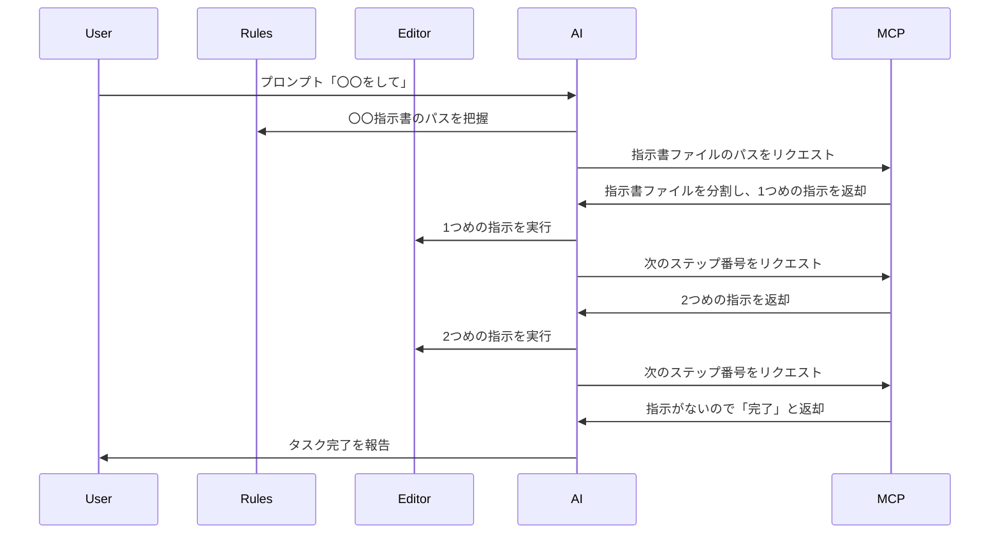

みなさんはそろそろバイブコーディングや、丁寧にプロンプトを出して、AIのタスクが完了をするのを待つことに慣れただろうか。筆者は全然慣れない。むしろAIに何を夢見たんだと毎日絶望している。

というのも、

- バイブコーディングほど雑に任せることが出来ない
- 丁寧にプロンプトを出すにしても、だいたい毎度の同じようなプロンプトを書いている
- そのくせタスクは多岐にわたるので`.clinerules`や`.cursor/rules/`に長い指示を書くことができない

といった感じに、コーディング業務の一部に偏りがある。もちろんうまくAIを利用できている開発もあるが、向かないケースはとことん向かない（しかもそれが業務の柱だと泣きたくなる）。

具体的には、

- サイト運用の定期的なページ追加
- 新規サイト制作時のテンプレート作成

のようなクライアントワークのウェブ制作におけるコモディティ化した部分なのだが、統一されたデザインシステムを用いることができないので、毎回同じような（しかし）異なるUIやコンテンツをゼロから作ることになる。

しかし、**ルーティン化されている部分は多いので、これらをうまくAIに任せたい**。

## 結論: 指示を分割して解決する

いろいろプロンプトを書いてみたが、現段階の解決策として**指示を分割して解決する**という方法をとっている。この結論に至った失敗を挙げてみよう。

### 失敗1: 指示が長い

一度に大量の指示をAIエージェントが受け取ると、最初は大丈夫だが、だんだんと指示を無視したり、指示以外のことをしたりすることがある。

### 失敗2: 指示とルールを混ぜている

たとえば`.clinerules`や`.cursor/rules/`はルールを規定するところだが、プロンプトを省略したいがためにこのファイルに指示を書いてしまう。これをしてしまうとルール内容が大量になってしまう。ここも指示が長いのと同様に、指示を無視したり、指示以外のことをしたりすることになってしまう。

### 失敗3: 指示が複数のタスクを含んでいる

失敗2は実は指示が少なければあまり問題にならない。（そのため失敗と気づくのが遅くなってしまったのだが、）いろんな種類のタスクを増やしたくなり`.clinerules`にどんどん指示を書いていくと、結局指示やルールが大量になってしまい、AIエージェントの振る舞いが不安定になり精度が悪くなっていく。

### 失敗4: 複数のルールが混ざっている

また、たとえばページを作ることとコンポーネントを作ることでは対象のディレクトリや関係するファイルが微妙に異なり、それぞれで独立したルールを持っていたりする。しかしそれが同じコンテキストウィンドウに存在してしまうことで、ルールを混ぜて解釈してしまい、結果としてタスクを解決できないことがある。

### 解決へのヒント

ということで、これらを踏まえると

- **指示はなるべく短く小出しに分割して出す**
- **ルールは独立しているか、指示の中に含める**

といったことをすればAIエージェントの精度を高めることができるのではないかと考えた。むしろそうじゃないと精度は安定しないのだろうと。

### その都度、分割した指示をプロンプトに書けばいいのでは？

ド正論。しかし、そんなにVS CodeやCursorに張り付いてられない。AIエージェントを使う意味とは？となってしまう。バイブコーディングよろしく「〇〇やっといて」で、完了まで放置したいのである。

## ということで分割して指示を出すMCPサーバを作った

仕組みは簡単。

- `.clinerules`や`.cursor/rules/`に「〇〇の指示があればMCPサーバーを使って〇〇指示書を読み、サーバが返す指示を実行せよ」を書いておく
- AIエージェントはMCPサーバに「指示書ファイルのパス」をリクエストする
- 指示書ファイルをMCPサーバが読み込み、分割し、1つめの指示をAIエージェントに返却する
- 指示を受け取ったAIエージェントは、指示を実行する
- ☝️**ここがポイント** 1つめの指示には「ステップ2へ進め」という指示を含めている
- AIエージェントが1つめの指示を終えると、MCPサーバに「指示書ファイルのパス」と、「次のステップ番号」をリクエストする
- MCPサーバは指示書ファイルを読み込み、分割し、2つめの指示をAIエージェントに返却する
- これを繰り返す

これで、最初に「〇〇をして」という指示だけ出せば、あとはAIエージェントとMCPサーバが勝手に手順通りに指示を実行してくれる。

※ Rulesは`.clinerules`や`.cursor/rules/`のこと

### MCPサーバーのツール実装

- `cwd`: 現在の作業ディレクトリ
- `filePath`: 指示書ファイルのパス
- `step`: ステップ番号

https://github.com/d-zero-dev/mcp-server/blob/57bad2ea498fd720d12079579b22e3ed7a715a54/src/index.ts#L45-L67

### 指示書分割の実装 `getTaskStep()`

ファイルを分割して、与えられたステップ番号の部分だけ返却するだけの関数

https://github.com/d-zero-dev/mcp-server/blob/57bad2ea498fd720d12079579b22e3ed7a715a54/src/utils/get-task-step.ts#L7-L36

## Clineでの設定例

### `.clinerules`

なるべく指示などを含まないようにしておく。あくまでルール（いや、指示なんだけど）。

条件分岐的になるので、明示的に書くと良さそう。

https://github.com/d-zero-dev/frontend-env/blob/db109a8d268dee572431d1865d870a5bb30c7193/packages/%40d-zero/scaffold/.clinerules#L7-L9

### `.clineignore`

直接指示書を読み込まれると困るので指示書ファイルを除外設定しておく。

https://github.com/d-zero-dev/frontend-env/blob/db109a8d268dee572431d1865d870a5bb30c7193/packages/%40d-zero/scaffold/.clineignore

### `./ai-tasks/{task-name}.md`

指示書ファイル。

https://github.com/d-zero-dev/frontend-env/blob/db109a8d268dee572431d1865d870a5bb30c7193/packages/%40d-zero/scaffold/ai-tasks/create-component.md

https://github.com/d-zero-dev/frontend-env/blob/db109a8d268dee572431d1865d870a5bb30c7193/packages/%40d-zero/scaffold/ai-tasks/create-page.md

各ステップから、ステップ番号を明示してスキップすることで条件分岐的な指示を出すこともできる。

なお、`use_mcp_tool`はClineがツールを使う際の識別子^[Clineの[システムプロンプト](https://github.com/cline/cline/blob/main/src/core/prompts/system.ts)]なので、明示すると自然言語を使うよりも精度が高まる（気がする）。

このように、リポジトリ内で指示書を管理することができるので、プロジェクトによって異なる指示書を複数管理することができる。もしくはウェブに置いて指示書をURLからfetchするようにMCPサーバを改造してもいいかもしれない。共通の指示書はそれで一元管理ができる。

## まとめ

というわけで、かなり簡単な仕組みでタスクの精度を上げることに（今のところ）成功した。しかも最初の簡単な指示を出すだけで、ほぼ完了までいける。バイブコーディングと劇詰め指示のハイブリッドがうまくいっている。

コモディティ化したルーティンタスクに限らず、長いステップのある指示にももしかしたらこの方法が使えるかもしれないし、繰り返し処理するタスクにも使えるかもしれない。わりと可能性を感じているアプローチではある。

ぜひ参考にしてみてほしい。
